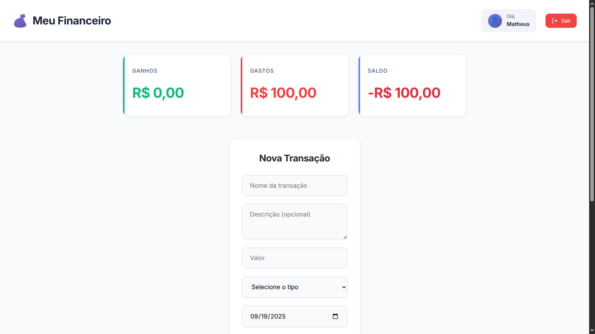
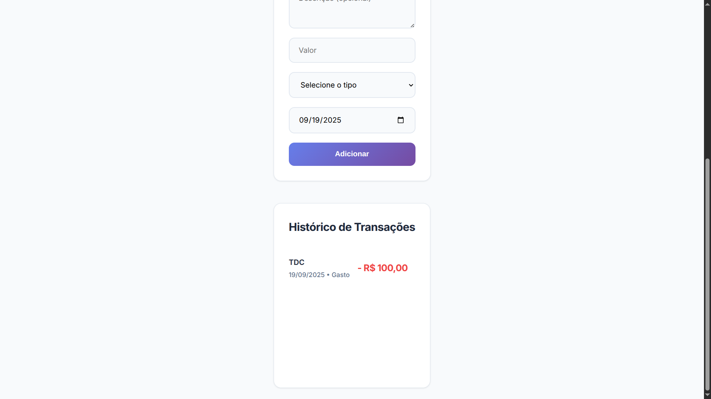

# 💰 Gerenciador Financeiro

[](https://github.com/topics/q-developer-quest-tdc-2025)

Uma aplicação web moderna para controle de finanças pessoais, desenvolvida com HTML, CSS e JavaScript vanilla.

## 📸 Preview da Aplicação




## ✨ Funcionalidades

- **Sistema de Autenticação**: Login e cadastro de usuários
- **Gestão de Transações**: Adicionar, visualizar e excluir transações financeiras
- **Categorização**: Separação entre ganhos e gastos
- **Resumo Financeiro**: Cards com totais de ganhos, gastos e saldo
- **Histórico Completo**: Modal com todas as transações do usuário
- **Detalhes de Transação**: Visualização completa de cada transação
- **Perfil Personalizável**: Configuração de avatar, nome e senha
- **Notificações Toast**: Sistema de feedback visual elegante
- **Confirmações Personalizadas**: Modais de confirmação customizados
- **Design Responsivo**: Interface adaptável para dispositivos móveis

## 🚀 Como Usar

1. **Clone ou baixe o projeto**
2. **Abra o arquivo `index.html` em um navegador**
3. **Cadastre um novo usuário ou faça login**
4. **Comece a gerenciar suas finanças!**

## 📁 Estrutura do Projeto

```
├── index.html          # Página principal
├── style.css           # Estilos da aplicação
├── script.js           # Lógica JavaScript
├── money.png           # Ícone da aplicação
└── README.md           # Documentação
```

## 🛠️ Tecnologias Utilizadas

- **HTML5**: Estrutura da aplicação
- **CSS3**: Estilização e layout responsivo
- **JavaScript**: Lógica de negócio e interatividade
- **LocalStorage**: Persistência de dados no navegador
- **Google Fonts**: Tipografia (Inter)

## 📋 Lista de Prompts Utilizados no Desenvolvimento

1. **Estrutura Inicial**
   - "Crie um gerenciador financeiro simples com HTML, CSS e JavaScript"

2. **Melhorias de Design**
   - "melhore o header, está feio"
   - "deixe em um estilo mais moderno a aplicação"

3. **Funcionalidades de Transação**
   - "aumente o bloco de transações, ta muito pequeno. Faça que o padrão da data fique na organização brasileira"
   - "faça com que se eu clique no bloco "historico de transações" ele abra um bloco maior na tela centralizado mostrando seu historico de transações"
   - "Faça que na hora do cadastro de uma transação eu possa dar um nome e uma descrição"
   - "Quando eu clicar em cima de uma transação específica no historico de transações deve abiri um sub bloco mostrando mostrando todas as informações da transação"

4. **Melhorias de Interface**
   - "faça o icone de exclusão de uma trasação ser um lixinho preto e discreto"
   - "Faça com que a pessoa tenha a opção de configurar a própria conta podendo adicionar fotos e etc"
   - "Faça o botão de sair ficar com um icone mais bonito"

5. **Sistema de Notificações**
   - "tire o botão de configuração. Faça com que os pop-ups que aparecem quando faço um cadastro, adiciono uma transação, excluo uma e etc seja um bloquinho que aparece na tela e não um pop-up do navegador"
   - "faça que nao seja um alert quando aperto nesses eventos de adição e exclusão, faça que crie um bloco"

6. **Finalização**
   - "faça com que a foto money.jpg seja o icone da aplicação na barra de abas"
   - "faça um read.me desse projeto com um espaço para colcoar uma foto da aplicação, e que tenha tbm uma lista dos prompts utilizados"

## 🎨 Características do Design

- **Paleta de Cores Moderna**: Tons de azul, verde e vermelho para diferentes tipos de transação
- **Tipografia Limpa**: Fonte Inter para melhor legibilidade
- **Animações Suaves**: Transições e hover effects
- **Cards Responsivos**: Layout que se adapta a diferentes tamanhos de tela
- **Modais Elegantes**: Sistema de sobreposição com backdrop blur
- **Notificações Toast**: Feedback visual não intrusivo

## 💾 Armazenamento de Dados

Os dados são armazenados localmente no navegador usando `localStorage`, incluindo:
- Informações de usuários e senhas
- Transações financeiras
- Configurações de perfil
- Avatares personalizados

## 🔒 Segurança

- Validação de campos obrigatórios
- Verificação de senhas
- Isolamento de dados por usuário
- Confirmações para ações destrutivas

## 📱 Responsividade

A aplicação é totalmente responsiva e funciona bem em:
- Desktops
- Tablets
- Smartphones

## 🤝 Contribuições

Este projeto foi desenvolvido como exercício de aprendizado. Sugestões e melhorias são bem-vindas!

---

**Desenvolvido com ❤️ usando tecnologias web modernas**
